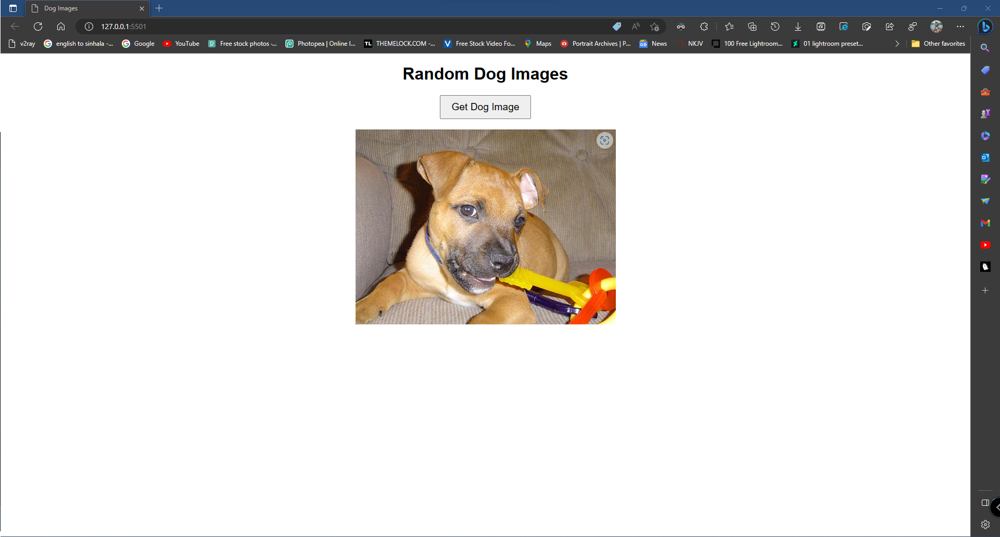

# Random dog image generator 🐶

A simple web app that displays random dog images fetched from the [Dog API](https://dog.ceo/dog-api/). This project demonstrates how to use HTML, CSS, and JavaScript to connect to a public API and update the website content dynamically.



## Features

- Fetches random dog images from the Dog API
- Displays images in a responsive layout
- Simple and clean user interface

## Getting Started

To run the project locally, follow these steps:

1. Clone the repository:

   ```bash
   git clone https://github.com/DFanso/Random-dog-image-generator.git

2. Change into the project directory: 
 ```bash
   cd dog-images

3. Open the index.html file in your favorite web browser.
